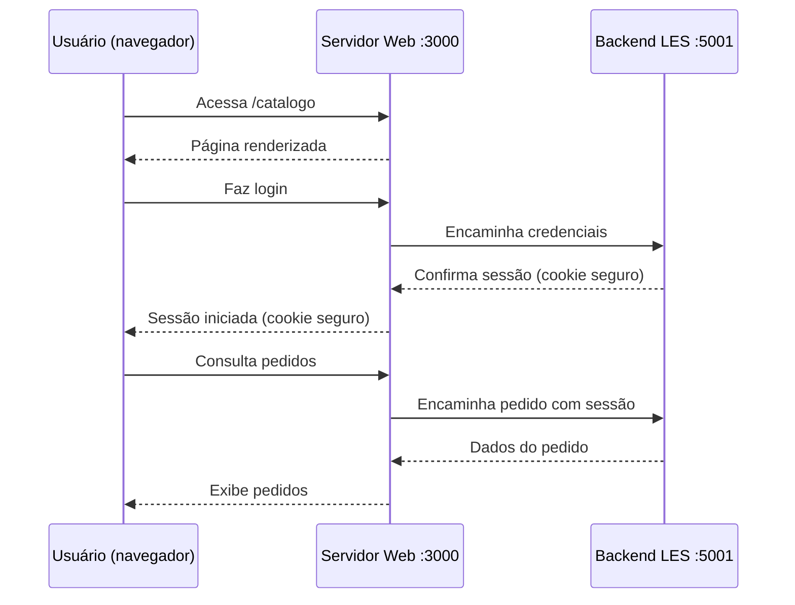
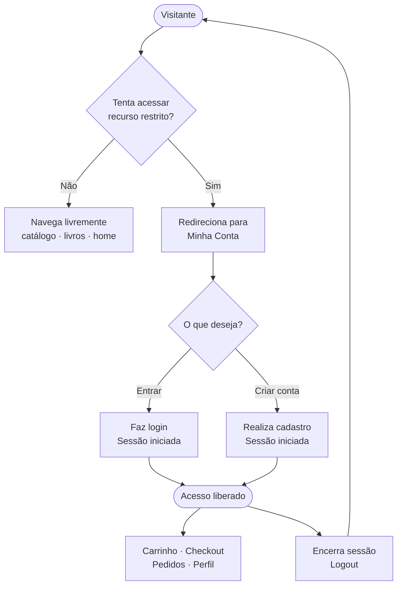
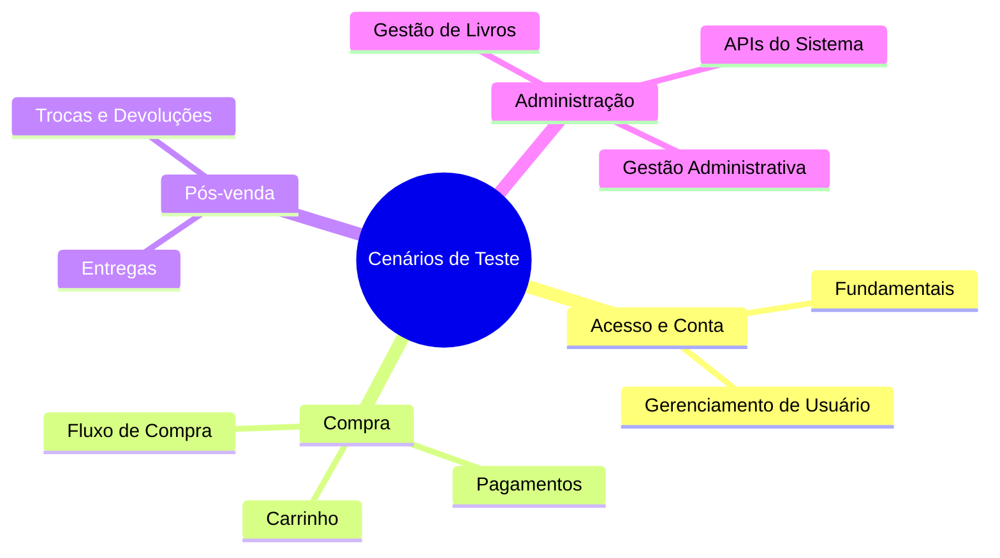

# LES — Interface do Cliente (Frontend)

Aplicação web da Livraria E-Commerce (LES) que permite ao cliente navegar pelo catálogo, realizar compras, acompanhar pedidos e gerenciar sua conta. Administradores de loja e de sistema também possuem painéis dedicados acessíveis pela mesma interface.

---

## Inicialização

```bash
cd web
npm install
cp .env.example .env
npm run dev          # abre em http://localhost:3000
```

---

## Como a Interface se Comunica com o Sistema

A interface nunca acessa o servidor diretamente pelo navegador. Todas as requisições passam pelo próprio servidor web, que as repassa internamente ao backend. Isso garante que a sessão do usuário (armazenada em cookie seguro) nunca fique exposta no navegador.



---

## Acesso e Sessão do Usuário

- A sessão do usuário é mantida por um **cookie seguro** definido pelo servidor — nenhum dado sensível fica salvo no navegador.
- Ao fechar o navegador ou fazer logout, a sessão é encerrada automaticamente.

---

## Entrada na Plataforma

> [!IMPORTANT]
> **Não existe uma página de login separada.** Login e cadastro de clientes são realizados na página **Minha Conta** (`/minha-conta`).
> Qualquer tentativa de acessar `/login`, `/registro` ou `/cadastro` redireciona automaticamente para lá.



---

## Perfis de Acesso

| Perfil | O que pode fazer |
|--------|-----------------|
| **Cliente** | Navegar, comprar, acompanhar pedidos, solicitar trocas e devoluções |
| **Administrador de Loja** | Gerenciar livros, estoque, pedidos e pagamentos da loja |
| **Administrador de Sistema** | Gerenciar lojas, usuários e configurações globais |

---

## Scripts de Desenvolvimento

| Comando | Descrição |
|---------|-----------|
| `npm run dev` | Inicia a aplicação em modo de desenvolvimento (porta 3000) |
| `npm run dev:e2e` | Inicia a aplicação para execução de testes (porta 3001) |
| `npm run build` | Gera a versão de produção |
| `npm run lint` | Verifica qualidade do código |

---

## Testes Automatizados

Os cenários de teste cobrem os principais fluxos do negócio, organizados em grupos temáticos:



```bash
# Executar grupo específico
npm run test:e2e:grupo1-fundamentais
npm run test:e2e:grupo2-gerenciamento-usuario
npm run test:e2e:grupo3-carrinho
npm run test:e2e:grupo4-admin-livros
npm run test:e2e:grupo5-admin-sistema-apis
npm run test:e2e:grupo6-pagamentos
npm run test:e2e:grupo7-compra
npm run test:e2e:grupo8-entregas
npm run test:e2e:grupo9-trocas-devolucoes
npm run test:e2e:grupo10-admin-sistema-gestao

# Executar todos os testes
npm run test:e2e:all

# Com navegador visível (sufixo :headed)
npm run test:e2e:grupo1-fundamentais:headed

# Cenário específico
npx cypress run --spec 'cypress/e2e/autenticacao/**/*.cy.ts'
```

> **Problema no Ubuntu 24.04:** caso os testes não abram, execute `npm run cypress:reset` para reinstalar o navegador de testes.

---

## Documentação Relacionada

- [Backend (API)](../backend/README.md)
- [Visão geral do projeto](../README.md)
- [Requisitos e decisões de arquitetura](../documentacao-exigida/README.md)
- [Diretrizes para desenvolvimento](AGENTS.md)
