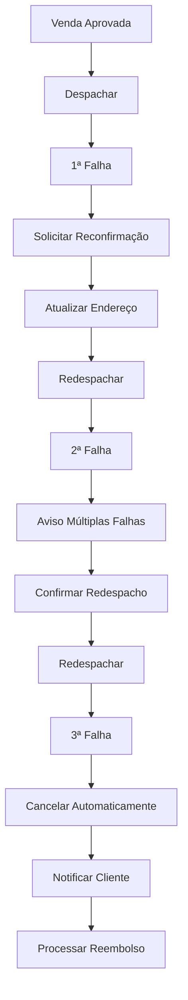

# Testes de Falhas Consecutivas de Entrega

## 📋 Visão Geral

Esta pasta contém os testes E2E refatorados para o fluxo de múltiplas falhas consecutivas de entrega, seguindo a **Regra de Negócio RN00XX**: *3 falhas de entrega consecutivas → cancelamento automático*.

## 🏗️ Estrutura

```
falhas/
├── README.md                           # Este arquivo
├── primeira-falha.cy.ts               # Testes da primeira falha
├── segunda-falha.cy.ts                # Testes da segunda falha consecutiva
└── terceira-falha-cancelamento.cy.ts  # Testes da terceira falha e cancelamento
```

## 📁 Arquivos

### 🎯 `primeira-falha.cy.ts`
**Foco:** Primeira falha de entrega e fluxo de redespacho

**Cobertura:**
- Marcação da primeira falha
- Verificação de status "Falhou"
- Fluxo completo de redespacho
- Atualização de endereço pelo cliente
- Validações de negócio

**Testes principais:**
- `deve permitir marcar primeira falha de entrega`
- `deve exibir motivo da falha nos detalhes`
- `deve permitir redespachar após primeira falha`
- `deve solicitar reconfirmação de endereço`

### ⚠️ `segunda-falha.cy.ts`
**Foco:** Segunda falha consecutiva e avisos

**Cobertura:**
- Marcação da segunda falha
- Exibição de avisos de múltiplas falhas
- Fluxo de redespacho com confirmação extra
- Contagem de falhas
- Notificações ao cliente

**Testes principais:**
- `deve permitir marcar segunda falha de entrega`
- `deve exibir aviso de múltiplas falhas na UI`
- `deve notificar cliente sobre segunda falha`
- `deve exigir confirmação extra para redespacho`

### 🚫 `terceira-falha-cancelamento.cy.ts`
**Foco:** Terceira falha e cancelamento automático

**Cobertura:**
- Cancelamento automático após 3ª falha
- Bloqueio de ações pós-cancelamento
- Notificações ao cliente
- Histórico completo e auditoria
- Reembolso automático (se aplicável)

**Testes principais:**
- `deve cancelar automaticamente após terceira falha`
- `deve exibir aviso de cancelamento automático`
- `deve notificar cliente sobre cancelamento`
- `deve registrar histórico completo das 3 falhas`

## 🔧 Helper Compartilhado

### 📚 `falhasHelpers.ts`
Localização: `web/cypress/support/helpers/falhasHelpers.ts`

**Funções principais:**
- `executarFluxoPrimeiraFalha()` - Fluxo completo da primeira falha
- `executarFluxoSegundaFalha()` - Fluxo completo da segunda falha  
- `executarFluxoTerceiraFalha()` - Fluxo completo da terceira falha
- `verificarPedidoNaLista()` - Verificação na UI
- `verificarAvisoMultiplasFalhas()` - Verificação de avisos
- `verificarAvisoCancelamentoAutomatico()` - Verificação de cancelamento

**Constantes:**
- `MOTIVOS_FALHA` - Motivos padrão para cada falha
- `ENDERECO_TESTE_FALHA` - Endereço padrão para testes

## 🎯 Padrões Utilizados

### Page Objects
- `AdminPedidosPage` - Interface do painel administrativo
- `CheckoutPage` - Interface de checkout (se necessário)

### Timeouts Padronizados
- `TIMEOUT.REDE` - 20s para chamadas API
- `TIMEOUT.RENDER` - 10s para renderização
- `TIMEOUT.VISUAL` - 5s para assertions visuais

### Estratégia de Testes
- **E2E UI real** com setup mínimo via API
- **1 comportamento por arquivo** (user-centric)
- **Sem waits visuais desnecessários**
- **Documentação adequada** em cada teste

## 🔄 Fluxo Completo



## 🧪 Execução dos Testes

### Executar todos os testes de falhas:
```bash
npx cypress run --spec "cypress/e2e/vendas/falhas/*.cy.ts"
```

### Executar arquivo específico:
```bash
npx cypress run --spec "cypress/e2e/vendas/falhas/primeira-falha.cy.ts"
```

### Executar no modo interativo:
```bash
npx cypress open --spec "cypress/e2e/vendas/falhas/"
```

## 📊 Cobertura

### Funcionalidades Cobertas:
- ✅ Marcação de falhas de entrega
- ✅ Redespacho após falhas
- ✅ Atualização de endereço
- ✅ Cancelamento automático
- ✅ Notificações ao cliente
- ✅ Histórico e auditoria
- ✅ Validações de negócio
- ✅ Verificações na UI

### Casos de Teste:
- **Primeira Falha:** 8 testes
- **Segunda Falha:** 10 testes
- **Terceira Falha:** 12 testes
- **Total:** 30 testes

## 🔍 Melhorias Implementadas

### Antes (Arquivo Monolítico):
- ❌ 930 linhas em um único arquivo
- ❌ Código repetido entre testes
- ❌ Dificuldade de manutenção
- ❌ Testes acoplados

### Depois (Arquitetura Modular):
- ✅ 3 arquivos focados (~250-400 linhas cada)
- ✅ Helper com funções compartilhadas
- ✅ Fácil manutenção e extensão
- ✅ Testes isolados e independentes
- ✅ Documentação adequada
- ✅ Page Objects reutilizáveis

## 🚀 Próximos Passos

### Possíveis Extensões:
1. **Testes de Performance** - Tempo de resposta das APIs
2. **Testes de Carga** - Múltiplos pedidos com falhas
3. **Testes de Acessibilidade** - Verificação de leitores de tela
4. **Testes de Cross-browser** - Compatibilidade entre navegadores
5. **Testes de Mobile** - Fluxo em dispositivos móveis

### Sugestões de Melhoria:
1. **Paralelização** - Execução paralela dos testes
2. **Data-driven** - Parâmetros de teste dinâmicos
3. **Visual Regression** - Comparação de screenshots
4. **API Coverage** - Medição de cobertura de endpoints

## 📝 Notas Importantes

- **Setup Mínimo:** Apenas pré-condições via API (`cy.request`)
- **Estado Real:** Testes executam contra banco de dados de testes
- **Isolamento:** Cada teste é independente e limpa seu estado
- **Documentação:** Cada arquivo tem documentação completa
- **Padrões:** Segue convenções do projeto e melhores práticas Cypress

---

**Última atualização:** Refatoração concluída em 2024  
**Responsável:** Agente de Testes E2E  
**Versão:** 1.0.0